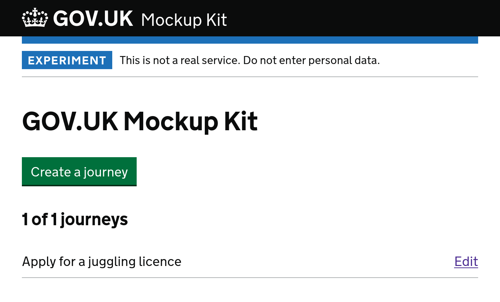

# GOV.UK Mockup Kit



A website builder that uses the GOV.UK Design System.

The design is derivative of (N.B.: stolen from) [GOV.UK
Forms](https://forms-prototypes.london.cloudapps.digital/).

Hosted here: **https://govuk-mockup-kit.herokuapp.com/** (username/password: mockup/kit)

## What is this

The user need:

> As a... person working on a government service<br />
> I need to... create a prototype without having to write code<br />
> So that... I can share it with colleagues or use it in research

The hypothesised solution (MVP):

> A website builder interface, that does not require technical knowledge to
> use, that allows the user to create pages and fill them with components from
> the [GOV.UK Design
> System](https://design-system.service.gov.uk/get-started/). The user can
> tweak content, change ordering of pages, and preview what their finished
> prototype will look like. At the end, they can export it as a prepopulated
> [govuk-prototype-rig](https://x-govuk.github.io/govuk-prototype-rig/)
> project.

This project will probably never be finished (maybe it isn't worth building?),
but like most things I work on and never finish I pushed it up to GitHub
anyway. If it sounds cool to you too feel free to reach out and chat to me
about it.

[Read the MVP design post.](docs/2022-05-22-mvp-design.md)

## Roadmap

- [x] 💥 Creating journeys
- [x] 📑 Adding pages
- [x] 🕵️ Previewing
- [x] 📠 Export to prototype kit
- [ ] 🔄 Syncing with a prototype
- [ ] 🧾 Check your answers
- [ ] 🏁 Customisable end page
- [ ] 📽️ Live preview
- [ ] ♻️ Reordering
- [ ] 🎶 Multiple page types

## Setup

Standard Rails 7 / Ruby 3 project. Example:

```sh
asdf install # Install optimal ruby/nodejs/etc versions, see .tool-versions
pg_ctl start # If not already running postgres

bin/setup    # bundle / yarn / database setup

bin/dev      # Local development on http://localhost:3000
bin/lint     # Run linters
bin/test     # Run all tests
```

## Licence

[GPLv3](LICENSE).
