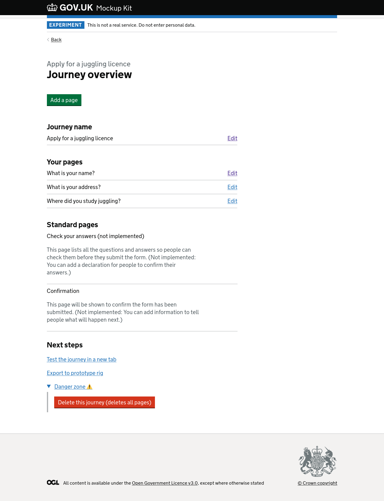
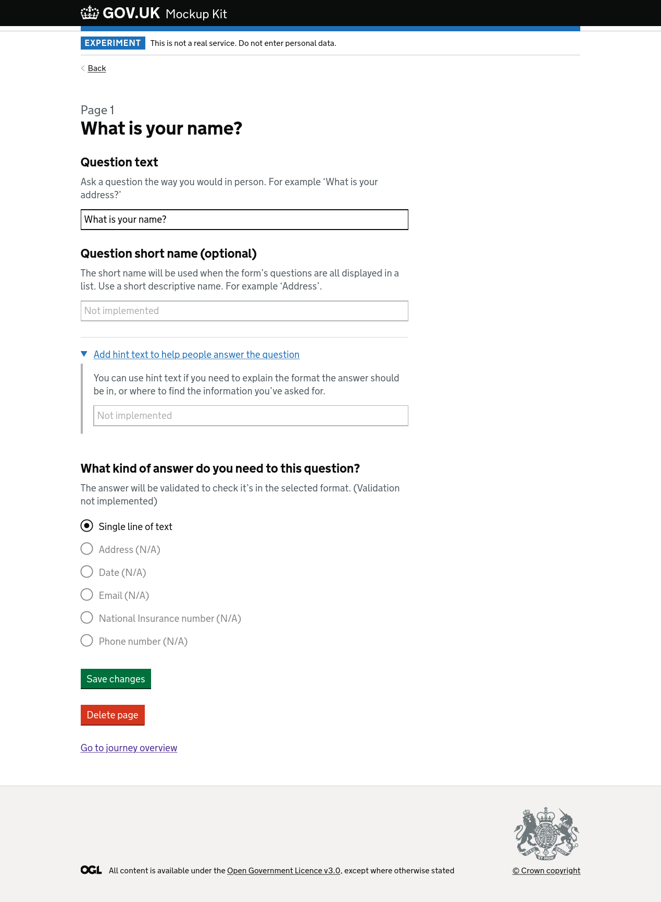
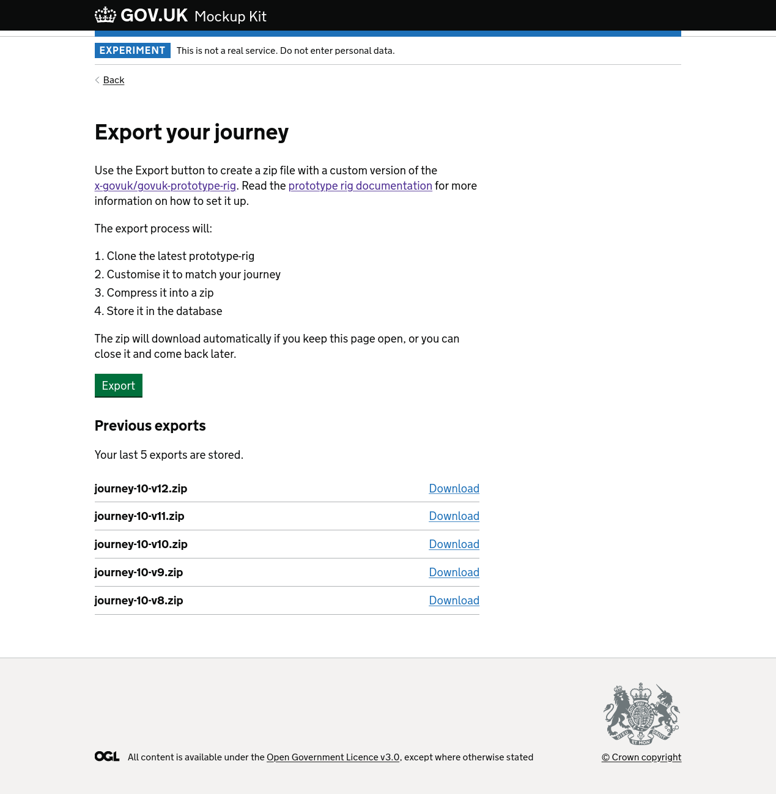

# GOV.UK Mockup Kit – MVP design and build

Date: 2022-05-22

Written by: [Theodor Vararu](https://github.com/tvararu/)

I had an idea a week ago: website builders like Wix and Squarespace are popular
and widely used. Wouldn't it be nice if there was one that allowed you to
cobble together components from the [GOV.UK Design
System](https://design-system.service.gov.uk/get-started/)? What if you could
then export it as a
[govuk-prototype-rig](https://x-govuk.github.io/govuk-prototype-rig/) project
to flesh out the parts that the website builder can't handle for you.

## Initial design/tech thoughts

I thought about building this as a single page app (SPA). The UI would be a
live preview of the service you're prototyping, and a konami code / explicit
button buried somewhere in the footer would bring up the "builder UI," with
your standard website builder doohickeys. A palette of components on the left,
from which you can drag and drop them into the centre, a pencil icon when you
hover over a paragraph allowing you to edit the content, and so on...

I started thinking about some of the issues with a standard Squarespace-like
interface.

Like that they don't work without JavaScript. Or how hover, drag and drop, and
moving/shifting elements could exclude some users.

Moreso, the effort involved in engineering an accessible and robust SPA already
made me feel weary. Not too long ago, I had given up on a project involving
Electron and Typescript, because the combination proved fatal to any sense of
momentum I had in building the actual thing I wanted to build.

"But wait," I said. "Why not just build it as a standard server-rendered app."
I thought about a new design, still involving "the preview" front and centre.

But now there would be some explicit buttons scattered around. One at the end
of the page's content, to "Add a new component," that takes you to a page with
a select/radios to choose what kind of component you'd like, then a form to
fill it out, then plop you back to your updated preview. All just standard
server-rendered pages, and good old forms. And then, progressive enhancement
layered on top, to allow inserting things quicker with fewer full page
navigations. The picture I had in my head was looking a lot better.

Choosing a mainly server-rendered approach also meant that I could use Rails,
hopefully avoiding the pitfall of getting stuck in setting up the project and
never actually getting to the part where I build the bespoke thing.

## Setting up

I used the recent `rails new --minimal` generator, which I've never done
before, so that I could get more control over picking and choosing which parts
of Rails to insert into the project. Then came the usual; Postgres, `asdf`, a
`Procfile` for Heroku, linters.

### The name

I called the project `govuk-mockup-kit`, because I was looking for synonyms of
"prototype" and thought that "mockup" could mean a lower fidelity prototype in
this context. I'm still thinking about better names; maybe something more
verby one, like `Design a journey`.

### Live reloading

One interesting find was
[hotwire-livereload](https://github.com/kirillplatonov/hotwire-livereload). I
was looking for a way to refresh CSS/JS after I edit it. I gave it a try, and
was pleased with how it worked, even refreshing HTML _in-place_ without a
browser refresh.

While (still) a bit skeptical of the value of
[hotwired/turbo](https://github.com/hotwired/turbo), I liked the livereload in
local development, so decided to leave it on even in production.

Once I had [govuk-frontend](https://design-system.service.gov.uk/),
[govuk-components](https://govuk-components.netlify.app/), and
[govuk-form-builder](https://govuk-form-builder.netlify.app/) in, I had
everything I needed to actually start building.

| Screenshot                                                                  |
| --------------------------------------------------------------------------- |
|  |
| _The start page of the service, showing a journey_                          |

## Discovering GOV.UK Forms

Serendipitously, a colleague from work shared a YouTube presentation by the
[GOV.UK Forms](https://github.com/alphagov/forms-prototypes) team, showing off
their prototypes and work they've been doing.

In all honesty: I don't even remember a word they said in the video. I'll have
to watch it again. All I remember is that I saw the prototypes and was fixated.
I really liked the design. I immediately decided to steal it and iterate on it.

Fundamentally, GOV.UK Forms serves a slightly different niche from
`govuk-mockup-kit`. The users are roughly the same, "non-DDaT professionals."
But Forms is being designed (and in the future will be built) to scale and
produce production-grade services. Not prototypes. Also, wisely, they are
initially focusing on just simple wizard style forms.

### "Journeys" and "Pages," instead of "Forms" and "Questions"

GOV.UK Forms could probably describe its models as such:

```rb
class Form
  has_many :questions
end

class Question
  belongs_to :form
end
```

I decided to go with slightly different names, to reflect the more generic
nature of `govuk-mockup-kit`:

```rb
class Journey
  has_many :pages
end

class Page
  belongs_to :journey
end
```

Eventually, pages can have types, one of those can be question, [polymorphism
and so on and so
forth](https://scribe.rip/swlh/polymorphic-associations-in-rails-with-example-8375de65510b).
The bridge will be crossed later.

Journeys could also be called "Services," but that overlaps with a bunch of
programmer-lingo, so I decided against it for now.

## The build process

What follows is a snapshot of all the pages in the initial MVP with some
scattered thoughts and some of the design decisions. I'll be taking detours to
dive into more specific topics.

## The new page

| Screenshot                                               |
| -------------------------------------------------------- |
|  |
| _The /journeys/new page_                                 |

The least complicated page is the new page, just a simple form with some
validation.

One interesting bit here was that it's where I stumbled on what [Hotwire and
Turbo](https://hotwired.dev/) actually does.

### About Turbo

In a nutshell, [paraphrasing the thorough explanation in the Turbo
handbook](https://turbo.hotwired.dev/handbook/introduction),
`@hotwired/turbo-rails` runs JavaScript in your browser that overrides
link/button handlers. When you click on a link with Turbo enabled, JavaScript
will `fetch` the page you want to navigate to and replace the `<body>` with the
new page. Turbo also caches the content of previously navigated pages.

When I saw it in practice in the Journey creation form, it felt "like
cheating." But it also felt robust, and it works the same without JavaScript.

One thing that did break out of the box was the automatic focus that GOV.UK
Error summaries get when they are instantiated in the page.
[`initAll()`](https://frontend.design-system.service.gov.uk/get-started/#5-get-the-javascript-working)
is only run at the start of rendering a page, but Turbo inserts pages
dynamically. To fix this in an idiomatic way, I had to bring in
[stimulus](https://stimulus.hotwired.dev/) and wrap every GOV.UK Frontend
component with a small controller:

```js
// app/javascript/controllers/govuk_error_summary_controller.js
import { Controller } from "@hotwired/stimulus";
import { ErrorSummary } from "govuk-frontend";

// Connects to data-module="govuk-error-summary"
export default class extends Controller {
  connect() {
    new ErrorSummary(this.element).init();
  }
}
```

I also had to customise stimulus to connect to `data-module` instead of
`data-controller`:

```js
// app/javascript/controllers/application.js
import { Application, defaultSchema } from "@hotwired/stimulus";

const schema = {
  ...defaultSchema,
  controllerAttribute: "data-module",
};

const application = Application.start(document.documentElement, schema);

// Configure Stimulus development experience
application.debug = true;
window.Stimulus = application;

export { application };
```

### How Turbo impacts accessibility

When I read how Turbo works I immediately thought to myself "have they done
enough to make sure that screen reader users are not excluded, for example by
removing the browser navigation cues they rely on, or messing up their focus?"

The answer I came up with so far is: unclear. Using VoiceOver on Safari to test
the app, I indeed found that Turbo seems to introduce two bugs:

1. Clicking a link does not give you the audible feedback ("blips"/"pings")
   that the browser normally gives you when you are waiting for a page to load
   or it's fully loaded
2. Focus when clicking a link in the middle of the page can "stick" to the
   middle of the page, and land on a random paragraph or other content
   coincidentally located in the next page, instead of being moved to the
   top/the skip link

It's unclear if these are show stopping bugs for assistive technology users,
but they're both related to routing.

I've long had a desire to investigate what [Reach
router](https://reach.tech/router/), a React router explicitly designed with
accessibility in mind, does to mitigate these issues.

After I wrote that paragraph out, I decided to test Reach router briefly, and
indeed, it [explicitly handles focus
management](https://reach.tech/router/accessibility):

> When the location changes, the top-most part of your application that changed
> is identified and focus is moved to it.

This seems like a necessary enhancement to address point number 2 I raised
above. In my own testing, Reach Router was an improvement. For the first issue,
I'm not sure it is solvable in client-side JavaScript with the current web
APIs.

Doing some more testing made me even more uncertain, as the second issue I
described would also happen without Turbo enabled. Maybe focus management has
changed compared to how I remember it used to work. This point on its own is
deserving of a proper investigation and a blog post.

## The show page

| Screenshot                                                 |
| ---------------------------------------------------------- |
|  |
| _The show journey page_                                    |

The "show" page is mostly copied over from the Forms prototypes, but I had to
make some concesssions and drop some features. The MVP can't update check
answers / confirmation pages, and can't reorder pages. These can be added later.

Reordering pages can be done in a nicer way than it is in the prototype with a
bit of progressive enhancement and client-side JS.

At the end of the page is a "Danger zone" details element where I hid the
Destroy form. This is temporary; this feature should probably be more like a
page with a confirmation input asking you to type in something to confirm.

"Test the journey in a new tab" opens a working and interactive preview of the
mockup.

## The edit page page

| Screenshot                                           |
| ---------------------------------------------------- |
|  |
| _The edit page page_                                 |

For the page "edit" page, I descoped some of the fields and all but one type of
question. I wanted to focus the MVP on the end to end flow, not the individual
field types which I knew were doable.

The GOV.UK Forms prototype had the "Delete page" action inline with "Save
changes." This is actually tricky to do with regular HTML; can be done, with
CSS, but I decided this part of the design is likely to churn later, so I just
did it in the simpler way.

## The export page

| Screenshot                                                 |
| ---------------------------------------------------------- |
|  |
| _The export index page_                                    |

This page is completely bespoke. It explains the export process as it exists in
the MVP, and then offers a button. The MVP doesn't use background queues or
something smart to process; just a `system` call to a
[Thor](https://github.com/rails/thor) task. Only the last 5 exports are stored
currently.

I had to disable `data-turbo` on the submit, because my form action returns an
actual zip file, and Turbo simply downloads that in the background but doesn't
offer to save it. This is the first instance so far where I could see Turbo
breaking an existing feature if it was just plugged in into a larger app
without testing.

### Thor, God of Scaffolding

Thor is an interesting tool. It's used by Rails for all of the
`rails generator`s. It's quite robust, and I thought that it could be applied
to generating new files in the prototype kit.

Thor instructions look like this:

```ruby
template "app/views/start.html"
gsub_file "package.json", "Your service name", @journey.title
```

The `app/views/start.html.tt` file (`.tt` extension optional) looks like this:

```njk


{% set title = "<%= @journey.title %>" %}


<div class="govuk-width-container">
  <main class="govuk-main-wrapper" id="main-content" role="main">
    <h1 class="govuk-heading-xl"><%= @journey.title %></h1>
    {{ govukButton({
      text: "Start now",
      href: "<%= @next_page %>",
      isStartButton: true })
    }}
  </main>
</div>

```

When executed, Thor produces a `start.html` in the right folder, replacing
`<%= inline_ruby %>` with context from where the methods are being called. It
also replaces the relevant content in `package.json`.

## To be continued

The MVP allows a user to:

- Create a journey
- Add basic question pages
- Preview and test their work
- Export to the prototype rig

Other areas to explore in the future:

- Check answers page, actually tracking user submitted data
- Importing / syncing with an existing prototype, perhaps via GitHub directly
- A live preview of pages as you build them, like in GOV.UK Forms
